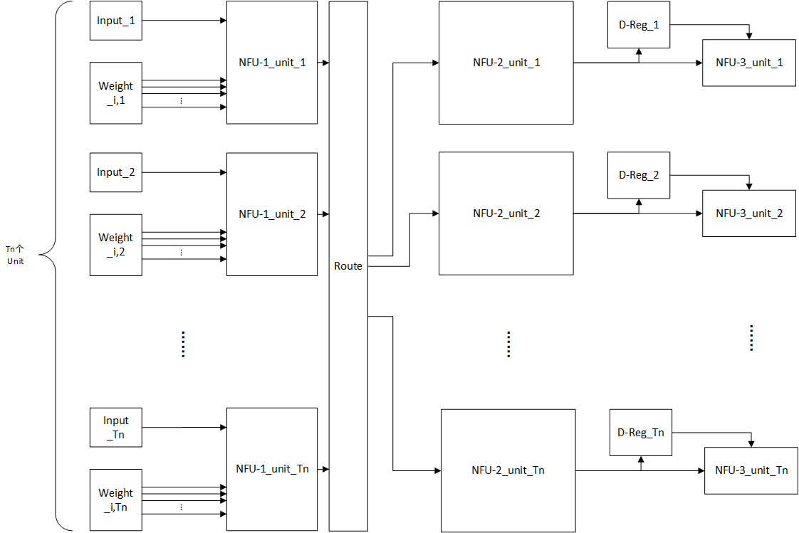
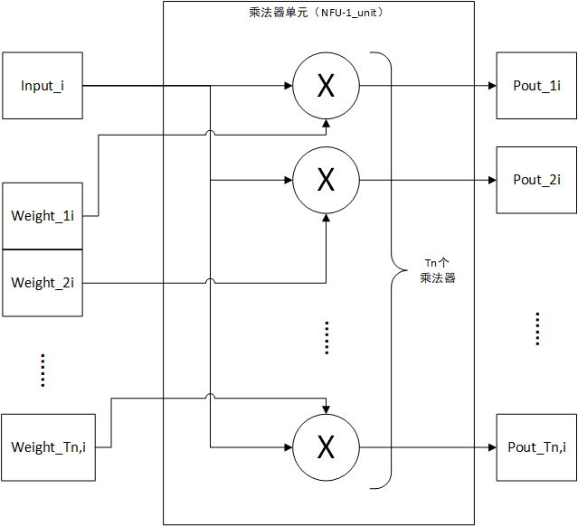

# 基本信息

| 名称         | 参数                             |
| ------------ | -------------------------------- |
| 数据输入位宽 | $T_n \times DW$bit               |
| 权值输入位宽 | $T_n \times T_n \times DW$bit    |
| 数据输出位宽 | $T_n \times DW$bit               |
| 功能         | 矩阵乘法、最大值池化、平均值池化 |
| 乘法器数量   | $T_n \times T_n \times T_n$      |
| 加法器数量   | $T_n \times (T_n - 1)$           |

# 结构

NFU的整体结构如上所示，该部分分为三个部分，分别是NFU-1、NFU-2和NFU-3三个部分，分别是乘法器阵列，加法或最大值树和非线性函数部分。NFU-1由一些乘法器阵列构成，如下图所示。一个单元具有一个输入数据$I_i$和$T_n$个输入权值，一个单元中共有$T_n$个乘法器，分别计算$I_i \times W_{ji}$的值，具有$T_n$个输出。

$T_n$个输入数据和$T_n \times T_n$输入权值经过NFU-1处理后，变为$T_n \times T_n$个部分积，第i个乘法器单元的第j个输出为$P_{ij} = I_i  \times W_{ji}$。所有部分积经过route分配给$T_n$NFU-2单元，分配规则如下所示，第i个NFU-2单元的输入是所有NFU-1单元的第i个输出。
$$
Input_i = \{P_{1,i},P_{2,i},P_{3,i},...,P_{T_n,i}\}
$$

NFU-2单元为加法/平均值（加法树前添加位移单元）/最大值（加法树的加法器可配置为取最大值）树，用于计算$T_n$个输入的和/平均值或最大值，如下所示：
$$
Output_i = mux\{\sum\limits_{k=1}^{T_n}P_{k,i},\frac{1}{T_n}\sum\limits_{k=1}^{T_n}P_{k,i},\max\limits_{0 \leq k \leq T_n}\{P_{k,i}\}\}
$$
NFU-2单元的输出为一个数据，整个NFU-2部分输出为$T_n$个部分操作数据。该输出可以流向NFU-3部分作为NFU-2的输出，也可以流向D-Reg作为部分和临时保存以节约带宽。NFU-3为一个加法器和一个非线性单元。非线性单元使用分段线性逼近非线性函数，分段线性逼近参数保存在RAM中，可通过更改该参数使该单元实现任意非线性函数。

# 运算映射

## 矩阵乘法/卷积

映射以下矩阵乘法：
$$
W \times x = y,W \in R^{T_n \times T_n},x \in R^{T_n}\\
y_{i} = \sum\limits_{j=0}^{T_n}{w_{ij}x_j}
$$
有以下配置：

- 数据输入：第i个NFU-1单元数据输入为$x_i$
- 权值输入：第i个NFU-1单元的第j个权值输入为$w_{ji}$，即第i个NFU-1单元输入的数据为W矩阵的第i列
- NFU-2：配置和实现加法树功能

## 池化

映射以下最大值操作：
$$
y = Max(x),x \in R^{T_n}
$$
有以下配置：

- 数据输入：第i个NFU-1单元数据输入为$x_i$
- 权值输入：所有权值配置为1
- NFU-2：配置实现最大值树功能（若为求平均值，配置为平均值树）

对于x的维度小于$T_n$时，推测可以将权值部分设置为1部分设置为0作为掩码，同时计算多个最大值/平均值操作