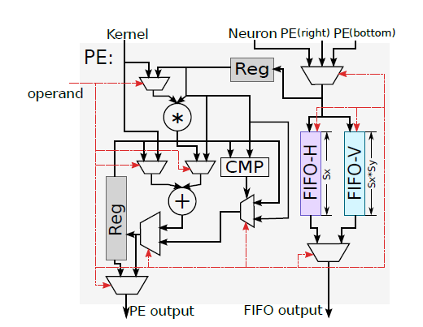
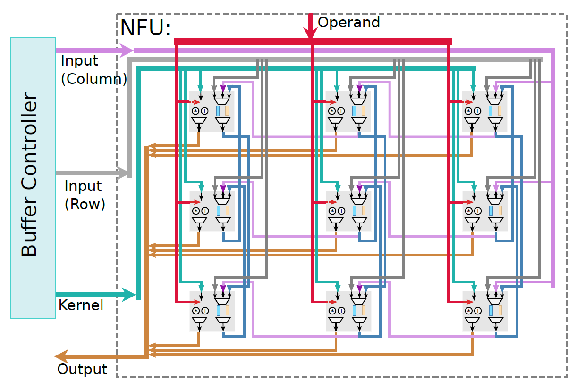
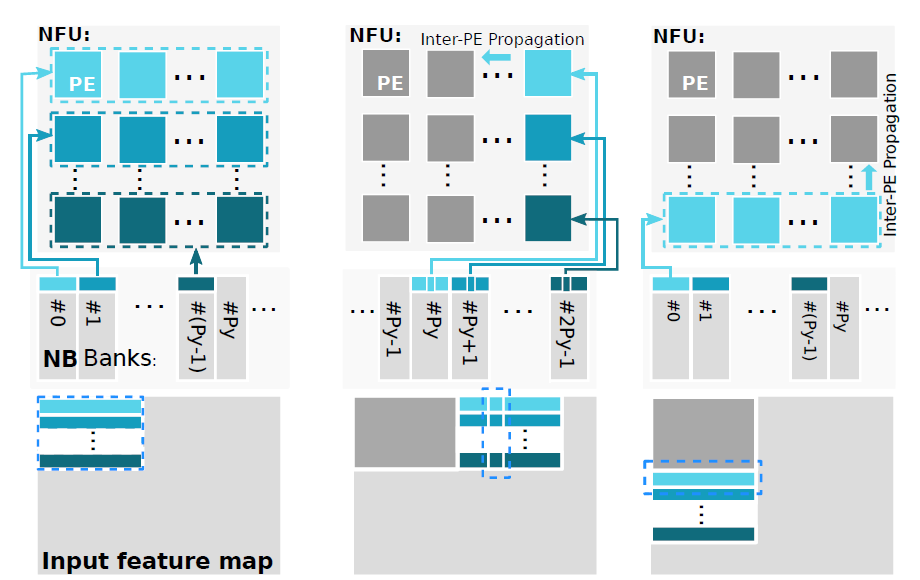
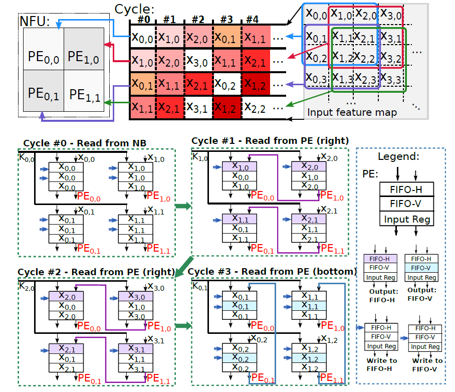
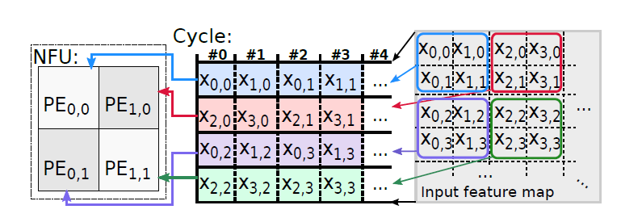

# 基本信息

| 名称         | 参数                                           |
| ------------ | ---------------------------------------------- |
| 数据输入位宽 | $64 \times 2B$                                 |
| 权值输入位宽 | $64 \times 2B$                                 |
| 数据输出位宽 | $64 \times 2B$                                 |
| 功能         | 卷积、矩阵乘法、最大值池化、平均值池化、标准化 |
| 乘法器数量   | 64                                             |
| 加法器数量   | 64                                             |

# PE结构

NFU由64个PE构成，每个PE结构如下图所示：

每个PE具有三个数据输入接口，根据命令从三个接口中选择一个数据作为本次的输入。权值输入接口仅有一个。输出接口有两个，分别是数据输出接口和结果输出接口，数据输出接口根据指令从以前输入的数据中输出一个，结果输出接口输出PE output接口上方的Reg保存的部分和结果。

对于运算部分，首先根据指令选择一个输入数据A，该数据通过MUX和乘法器可以实现：

- 与kernel数据K相乘
- 平方运算

随后乘法器的运算结果通过MUX和REG中的数据P进行操作可得结果M，可以实现：

- 累加：$M = P + K \times A$或$M = P + A^2$或$M = P + A$
- 加法：$M = K + K \times A$或$M = K + A^2$或$M=K + A$

另外，CMP还实现了操作$C = \max\{P,A\}$，通过MUX得单次运算的最终结果$P = mux\{M,C\}$，因此考虑需要在神经网络中的运算，可以实现的是：

- 卷积/矩阵乘法单个操作：$P = P + K\times A$
- 最大值池化单个操作：$P = \max\{P,A\}$
- 偏置操作：$P = P + A$
- 普通加法操作：$P = K + A$

对于数据转发部分，将运算部分选出的数据根据指令选择性的送入FIFO-H和FIFO-V中，输出数据时根据指令在FIFO-H和FIFO-V的输出数据中选择一个。

# NFU结构

NFU由2D的PE阵列组成，ShiDianNao中这一结构的尺寸为$8 \times 8$（图中只有$3 \times 3$）。NFU输入数据接口有两个，分别是行输入（位宽$8 \times 8 \times 2B$）和列输入（位宽$8 \times 2B$），其中行输入可以给所有的PE输入不同的值，列输入仅能给最右侧的一列输入数据。权值输入接口位宽为$8 \times 8 \times 2B$，具有给所有运算单元送入不同权值的能力。

对于每个PE的三个数据输入接口，分别来自行输入接口、下侧PE数据输出和右侧PE的数据输出，这一结构用于实现数据重用。

数据输出接口位宽为$8 \times 8 \times 2B$，可以实现所有PE同时输出。

# 运算映射

## 卷积操作

卷积操作的映射方式如上图所示，每个PE映射一个卷积神经元，数据窗口的移动分为以下几种情况：

- 初始化：向NFU中的所有PE输入对应位置的数据
- 右移：使用列输入方式从最右侧的一列输入对应数据，同时所有数据左移（选择右侧PE数据作为输入）
- 下移：使用行输入方式，但仅将数据输入最下一行，同时将所有数据上移（选择下侧PE数据作为输入）

观察数据窗口固定位置划过的数据，呈Z字形覆盖一个卷积窗口，即一个卷积窗口所需要的所有数据都被一个PE接收，另外，观察不同数据窗口中不同位置划过数据顺序，发现数据相同，因此所有PE在进行一次运算时共享一个权值，具体过程如下所示：

例如位于0,0坐标的PE，先后划过数据X00（行输入）,X10（来自右侧）,X20（来自右侧）和X01（来自下侧）

## 池化

池化操作一般没有数据重叠（重叠池化除外），池化操作时，也是每个PE映射一个池化神经元，具体过程如下所示：

## 矩阵乘法

映射矩阵乘法时，所有PE映射一个全连接神经元，每个PE送入不同的输入数据和权值数据

