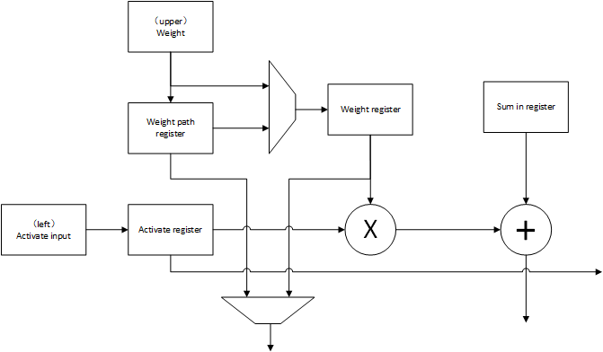
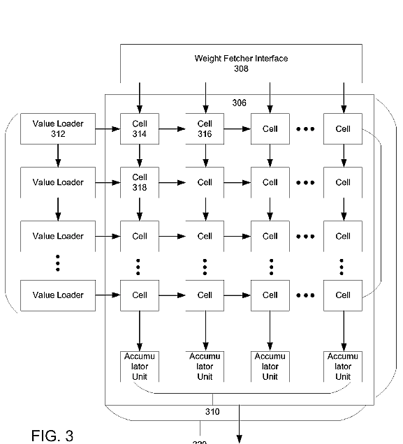
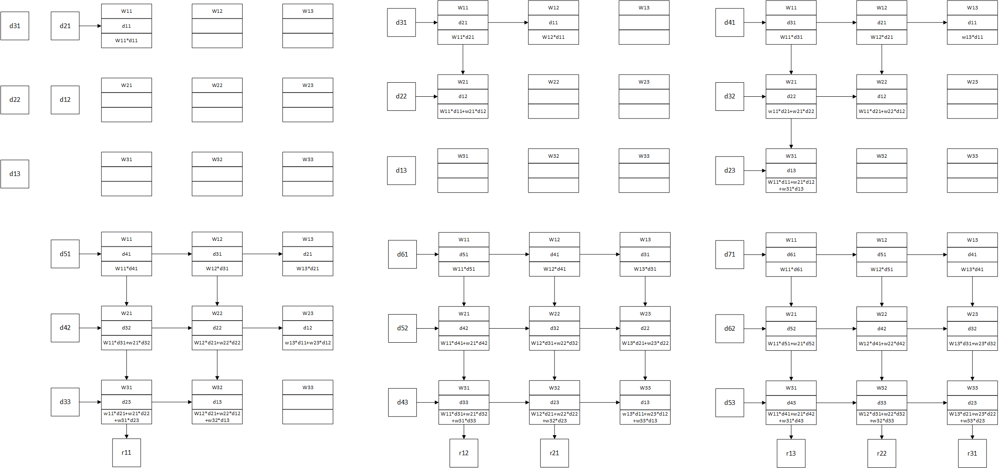
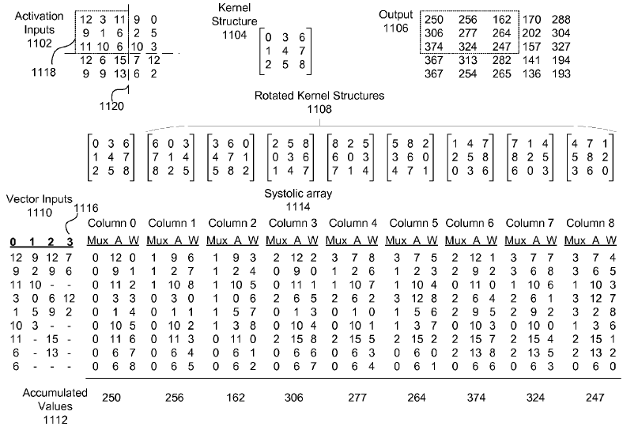

# 基本结构

## 运算单元结构

TPU的矩阵运算单元使用Systolic结构构成，上图为Systolic中每一个运算单元的基本结构，该计算单元比较简单，仅有乘加功能，按处理数据不同分为以下几个部分：

- 输入数据通路：activate input寄存器，用于存储乘加运算的一个操作数，该操作数来自左侧的运算单元，并将被传到右侧运算单元
- 权值数据通路：weight path register和weight register构成。weight path register数据来源于上方计算单元提供额权值，weight register数据来源于weight path register寄存器或者上方计算单元（可能不同，例如weight path register中保存上一时钟周期权值数据，而上方运算单元提供这一时钟周期权值数据）。同时可选的将weight path register和weight register中的传送到下方运算单元
- 计算通路：包括乘法器，加法器和sum in register（部分和寄存器）。该部分将权值与数据相乘后与上方计算单元提供的部分和相加，并将运算结果传送到下方运算单元

综上所述，该运算单元有以下功能：
$$
Input_{out} = Input_{in} \\
Weight_{out} = switch(weight\ path\ register,weight\ register) \\
Sum_{out} = Input_{in} \times weight\ register + Sum_{in}
$$

## Systolic网络

上图为systolic网络的整体结构，主要有以下几个部分构成：

- 运算单元阵列：由$256\times 256$个运算单元组成的正方形2D运算阵列，完成矩阵运算
- 数据缓存：图中的Value Loader，每行一个，共256个，用于从左侧向运算单元输入数据信息
- 权值接口：图中的Weight Fetcher Interface，用于从上方向运算单元输入权值信息

这一运算网络中，首先数据和权值被分别同步读入到数据接口Value Loader和权值接口Weight Fetcher Interface中，这一过程中数据接口Value Loader对读入数据进行整理与重复（减小存储器到运算模块的带宽压力）。随后数据与权值被依次注入运算单元阵列并向指定单元流动（数据从左向右流动，权值与部分和从上到下流动），运算结果从运算单元阵列的下方输出。

# 运算映射

## 矩阵乘法映射

根据目前已知资料和论文推理，下面提出一种可能的矩阵乘法的映射方式：

这种映射方式中，权值W是预先载入的，数据依次从左向右载入，部分和从上向下移动（运算单元没有在一个运算单元累加部分和的功能）。

## 卷积映射

上图为Google专利中给出的一种卷积映射方式，对于一个卷积窗口的数据，在通道这一维拆开，每个通道的输入数据送入阵列的一行。每个卷积核的权值也分别送入阵列的一列。据原专利所述：

> The activation and weight inputs can be shifted to the right and to the bottom, respectively, of the systolic array and must reach a particular position, e.g., a particular register at a particular cell. Once the inputs are determined to be in place, e.g., via control signals, the processor can perform calculations using the inputs stored within the cells to generate the given layer's output.

即以下几个操作：

- 输入数据从左到右移动
- 输入权值从上到下移动
- 计算部分和
- 部分和从上到下移动

均是相互无关的，仅在对应的控制信号下操作。对于每一次的计算（一个Cycle的计算），输入数据和权值都有预订位置，当输入数据和权值都移动到预订位置时，进行部分和的计算与移动。除了上述方法，Google的另一篇专利在更高层次提出了一种方法：

这种方法中，将每一个卷积的输入数据拆成$(kernel\_szie \times 2 - 1) \times (kernel\_szie \times 2 - 1)$的尺寸（$3 \times 3$卷积就拆成$5 \times 5$的数据块），然后按1120所指的方法划分为四个部分，每个部分都变成一个向量，如1110所示。输入权值进行指定的变换（如分块交换等），从1104变为9个卷积核即1108（1108中每个卷积核的数据与1104相同，仅排列顺序不同）。将四个向量和9个卷积核送入运算阵列中，其中`Mux`表示选择哪一个向量对应位置的输入；`A`为输入数据；`W`为输入权值。