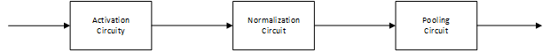
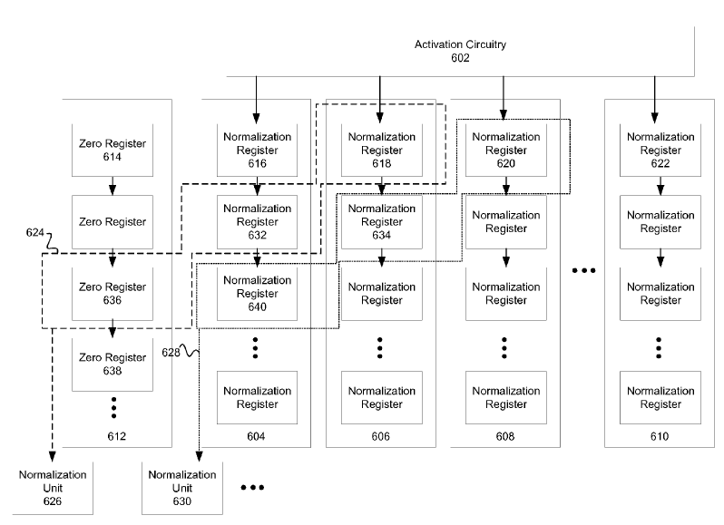
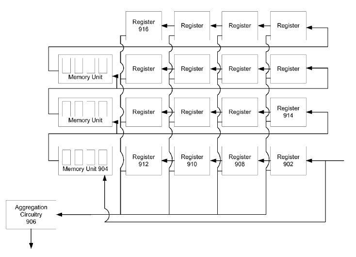

# 基本结构

上图为TPU中向量处理单元Vector Computation Unit的整体结构，该部分分为三个部分，每个部分实现一种功能：

- Activation circuit：激活函数部分，用于实现激活函数，可以使用查找表实现
- Normalization circuit：标准化部分，用于实现标准化操作
- pooling circuit：池化部分，用于实现池化操作，包括平均值池化和最大值池化

## 标准化部分

上图为标准化电路的组成，主要包括以下组件：

- 寄存器组（604-608）：这一部分为了缓存标准化所需要的数据
- 标准化单元（626,630）：实现标准化过程，输出标准化结果

这里实现的标准化如下式所示：
$$
y_i = \frac{x_i}{LUT(\sum\limits_{n=1}^{N}x_n^2)}
$$
寄存器组用于保存标准化所需要的所有数据，两侧各有一列0值寄存器用于处理边界情况。图中624和628框出的是标准化半径为1（每个数据和左右各1个数据进行标准化）的两个标准化区域。由于TPU的Matrix Computation Unit输出数据呈梯形（第一列先输出，一个时钟周期后第二列输出，以此类推），因此在标准化窗口628中的三个数据为寄存器640，634和620中保存的数据。

上图为标准化单元的结构图或处理流程图。对于一个标准化窗口中的每一个数据，都会分别被送入对应位置的标准化单元中，对于半径为1的标准化窗口，共三个数据，对应的被送入三个如上图所示的标准化单元中，每个数据首先被计算平方值，再从别的标准化单元中获得该标准化窗口中的其他数据的平方值，计算归一化参数，最后将原数据和归一化参数相乘获得归一化结果。

## 池化部分

上图为池化单元的总体结构，主要组成池化窗口寄存器，FIFO和池化计算单元构成。池化窗口寄存器和FIFO用于选择池化窗口，即调整FIFO的宽度和池化窗口寄存器一行的长度可以选择池化窗口的长度和在1维上的间隔，改变池化窗口寄存器的列数可以选择池化窗口的高度。数据依次输入，按箭头方向逐个移动，每次移动均可以给出一个池化窗口所需要所有数据，即如下图所示：

一个2D的池化窗口展开在1维上为几个间隔相等，长度相等的数据块，因此只需要将寄存器一行的长度调整为池化窗口长度，FIFO间隔调整为间隔，即可以在池化窗口寄存器获得池化窗口。这些数据被计算单元906接受，计算平均值或最大值，即为池化操作。