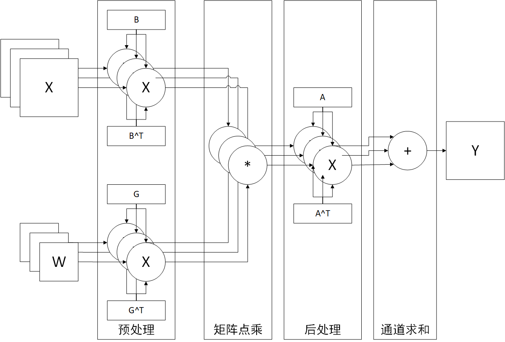
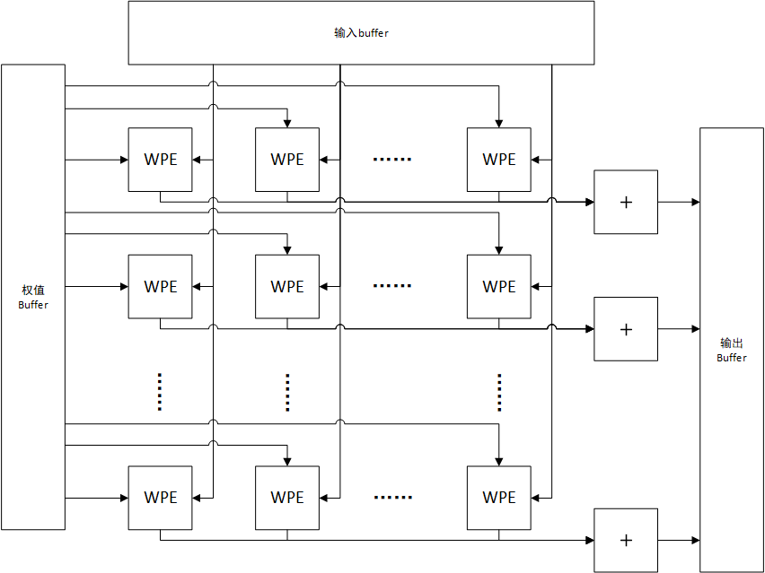

# Winograd原理

PE考虑使用Winograd卷积加速方式实现卷积运算，Winograd加速公式如下所示：
$$
Y = A^T \times [(G \times W \times G^T)\bigodot(B^T \times X \times B)] \times A
$$
其中，$X \in R^{n \times n}$为输入矩阵，$W \in R^{r \times r}$为权值矩阵，$Y \in R^{m \times m}$为输出矩阵，且有$n = m+r-1$；$A \in R^{n \times m}$、$G \in R^{n \times r}$和$B \in R^{n \times n}$为系数矩阵，与m与r有关。$\times $为矩阵叉乘，$\bigodot$为矩阵按位相乘。因此原来的单通道卷积$conv(W,D)​$被拆解为以下步骤：

- 预处理权值矩阵和输入数据矩阵：$U = GWG^T \in R^{n \times n}$和$V = B^TXB \in R^{n \times n}$
- 矩阵点乘：$Z = U \bigodot V \in R^{n \times n} $
- 结果后处理：$Y = A^TZA \in R^{m \times m}$

可以发现，Winograd加速方法的思路就是使用代价比较低的计算（矩阵乘法、矩阵点乘）代替代价比较高的计算（卷积）。其实现难度和代价相对于直接实现卷积较小，缺点是仅能处理单通道卷积，且系数矩阵与输入和权值尺寸有关，不容易使用ASIC实现，较适合FPGA实现。

# 基本结构

## 计算单元WPE结构

考虑卷积被拆分为以上三个步骤和多通道卷积的需求，计算单元结构如下所示：

输入为左侧的X和W，通道数为C，包括以下几个部分：

- 预处理部分：权值和数据的每个通道分别于相同的系数矩阵相乘，由$2 \times C$个相互独立的矩阵乘法器组成，输出为预处理后的权值和矩阵各C通道
- 矩阵点乘部分：通道标号相同的预处理后的权值和数据矩阵点乘，由C个相互独立的矩阵点乘器组成，输出按通道分别点乘结果共C个通道
- 后处理部分：每个输入通道分别于相同的系数矩阵相乘，由C个相互独立的矩阵乘法器组成，输出为处理后结果输出共C个通道
- 通道求和：将所有通道输出数据做矩阵加法，是一个输入C个矩阵输出1个矩阵矩阵加法器，输出后1个通道的卷积结果

即一个WPE实现的功能为计算一个尺寸为$1 \times C \times K \times K$的卷积核（1个卷积核，通道数为C）在尺寸为$C \times W \times H$的数据上的卷积结果（通道数为C，宽度W，高度H）。使用$[W_1,W_2,...W_C]$表示卷积核（每个$W_i$的尺寸为$K \times K$），$[D_i,D_2,...,D_C]$表示数据（每个$D_i$的尺寸为$W \times H$） 。则第一步通道预处理完成以下操作：
$$
U_i = BW_iB^T,i\in\{1,2,...,C\} \\
V_i = GD_iG^T,i \in \{1,2,...,C\}
$$
随后矩阵点乘部分完成以下操作：
$$
Z_i = U_i \bigodot V_i,i \in \{1,2,...,C\}
$$
后处理部分完成以下操作：
$$
Y_i = AZ_iA^T,i \in \{1,2,...,C\}
$$
最后一部分通道求和完成以下操作：
$$
R = \sum\limits_{i=1}^C Y_i
$$

## 计算阵列结构

原论文中未描述计算阵列的详细内容，这里推测计算阵列由计算单元组成2D-mesh结构，如下图所示：

整个mesh结构由$P_y$行、$P_x$列计算单元组成的，尺寸为$P_x \times P_y$，每一列计算单元的输入数据相同，每一行计算单元组合实现一个完整的卷积（相同行的计算单元输入为一个卷积核按输入通道分块，结果求和后为完整卷积结果），即设每个WPE可以处理尺寸为$1 \times C \times K \times K$的卷积核在$C \times W \times H$上的卷积，则每行WPE可以实现一个尺寸为$1 \times (P_x \times C) \times K \times K$的卷积核在尺寸为$(P_x  \times C)\times W \times H$的数据上的卷积。整个运算阵列可以实现尺寸为$P_y \times (P_x \times C) \times K \times K$的卷积核（$P_y$个尺寸为$(P_x  \times C)\times K \times K$的卷积核）在尺寸为$(P_x  \times C)\times W \times H$的数据上的卷积。