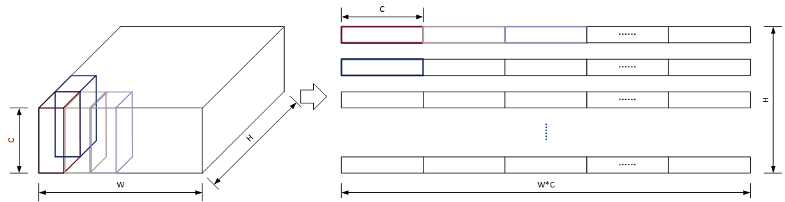
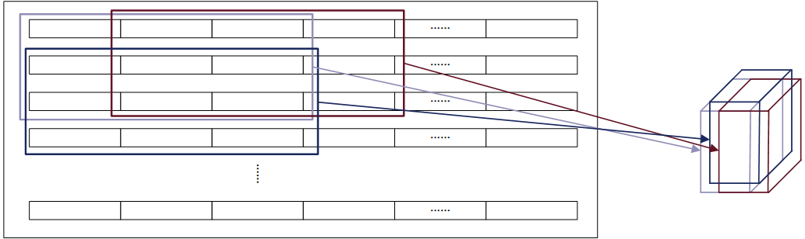

# 条带数据缓存

条带数据缓存如上图所示，为了存储一个$C \times W \times H$的输入Tensor，将其按`[维度，宽度，高度]`的顺序展开成一个2D结构，尺寸为$H \times (C \times W)$，即共H行，每行$C \times W$个数据，将缓存以条带为单位存储，即为条带存储。对于数据缓存，假设其可以存储P个条带，如下图所示：

因此，读入P个条带，即为读入了尺寸为$C \times W \times P$的输入Tensor的部分数据，可以在计算单元中完成所有与这一部分数据相关的卷积运算，当所有运算完成后，保留交叠的条带，读入下一部分的非交叠条带，则可以进行下一次运算，这种复用交叠部分的方法减小了输入数据的压力。