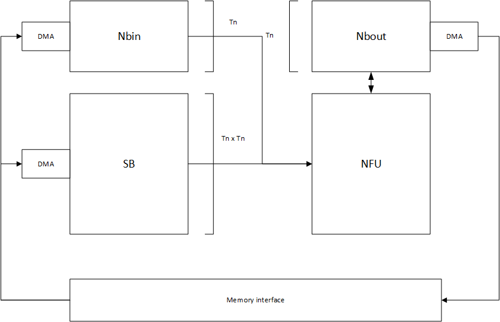

# 按功能分裂缓存

缓存被分为3个：

- Nbin：用于存储输入数据，需要考虑数据的重用性（输入数据重用），输出位宽为$T_n \times DW$
- SB：用于存储输入权值，一般不需要考虑数据重用性（权值不复用），输出位宽$T_n \times T_n \times DW$
- Nbout：用于存储部分和或最终结果，考虑部分和重新输入NFU，输入输出位宽$T_n \times DW$

分裂缓存的主要好处是：

- 增加访问带宽：分裂为3个缓存，可以同时对这三个缓存进行读写，增大三倍带宽
- 防止冲突：每个缓存的读写与别的缓存解耦，可以防止读写冲突的情况
- 提高效率：按功能进行分裂的缓存，每个功能需要的位宽可能不同，分裂缓存具有不同的输出位宽，可以提高访问效率，防止位宽浪费