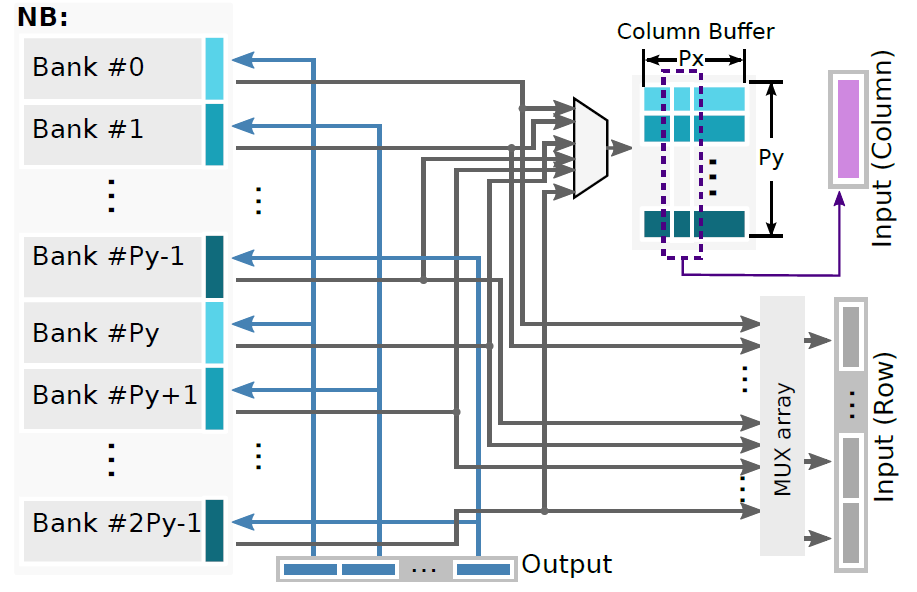
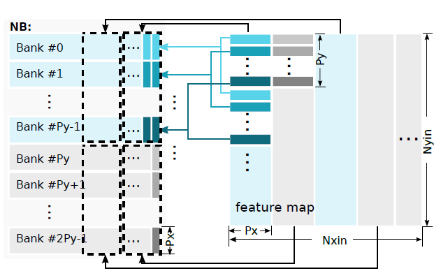
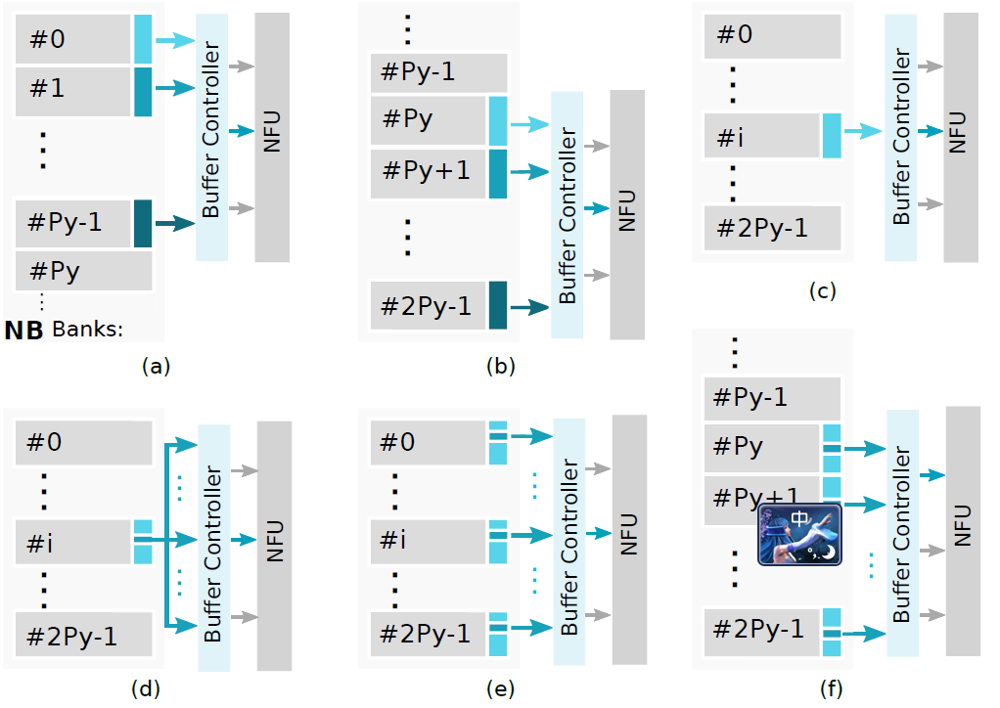

# 存储结构

三分裂buffer是常见的缓存结构，为了使这种buffer结构适配2D结构组织的计算单元，添加buffer controller

带缓存管理器的3分裂buffer结构如上图所示。对于每个缓存（输入数据、输入权值、中间数据）均再分裂为多个Bank，每个Bank均是物理结构，可以同时读或写，每个位宽是$Px \times 2B$。其中NBin和NBout分别是输入数据和中间数据缓存，各有$2 \times Py$个Bank，SB是权值缓存，有$Py$个Bank。其中$Px$是2D计算单元中计算单元的行数，$Py$是计算单元的列数。

# 数据映射

## 数据存储方式

输入数据的feature map在输入数据缓存的结构如下所示：

​		

一个Bank的宽度是$Px \times 2B$，上图左侧部分是一个2D的feature map，该feature map被分裂为$1 \times Px$的小块，第一列小块被交错存入Bank0\~BankPy-1，第二列的小块被交错存入Bank，feature map的存储位置具体如下表

| 行列        | 第一列（Px）     | 第二列（Px）      | 第三列（Px）       | ...  | 第2n列（Px）             |
| ----------- | ---------------- | ----------------- | ------------------ | ---- | ------------------------ |
| 第一行（1） | Bank#0 Addr#0    | Bank#Py Addr#0    | Bank#0 Addr#x+1    | ...  | Bank#Py Addr#nx+1        |
| 第二行（1） | Bank#1 Addr#0    | Bank#Py+1 Addr#0  | Bank#1 Addr#x+1    | ...  | Bank#Py+1 Addr#nx+1      |
| 第三行（1） | Bank#2 Addr#0    | Bank#Py+2 Addr#0  | Bank#2 Addr#x+1    | ...  | Bank#Py+2 Addr#nx+1      |
| ...         | ...              | ...               | ...                | ...  |                          |
| 第2m行（1） | Bank#Py-1 Addr#x | Bank#2Py-1 Addr#x | Bank#2Py-1 Addr#2x | ...  | Bank#2Py-1   Addr#(x+1)n |

## 数据IO

buffer管理器提供6种数据IO方式：

- 方式a和b：读Py个Bank的同一地址的共$Px \times Py$个数据，用于在卷积操作中填充所有计算单元，从feature map角度看读取了feature map中$Px \times Py$的连续数据块

- 方式c：读取某个Bank的某个地址的所有共$Px$个数据，在卷积中用于填充一行计算单元，从feature map角度看读取了feature map中的$1 \times Px$的数据块

- 方式d：读取某个Bank中某个地址中的某一个数据，从feature map角度看读取了某个像素的数据

- 方式e：不同Bank中同一地址间隔相同的若干个数据

- 方式f：从Py\~2Py-1的Bank中读取同一地址指定位置的Py个数据，在卷积中操作用于填充一列，从feature map中看读取了$Py \times 1$的所有数据

