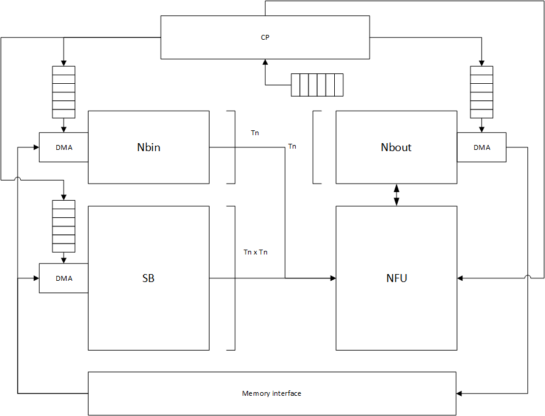
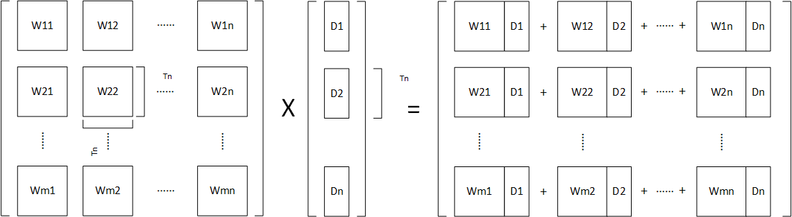
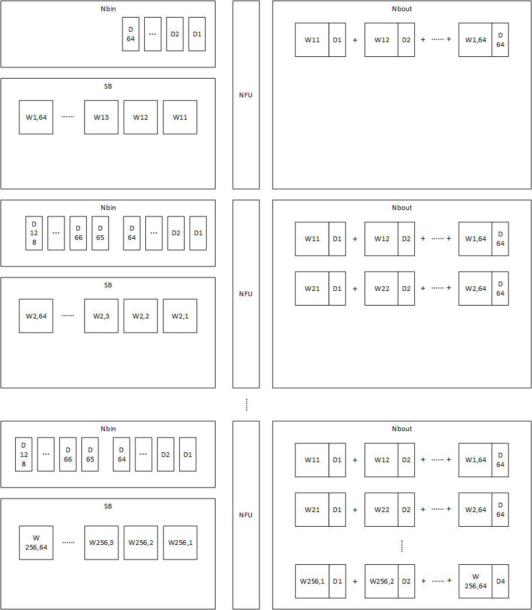

# 系统结构

系统结构如上所述，各部分：

- NFU：神经计算单元，已经加入compute_unit的pool中
- 分裂缓存：按功能分裂为三个的缓存，已经加入memory的pool中
- 控制模块CP：指令使控制，每个指令分为四个部分，分别是NBin指令，NBout指令，SB指令和NFU指令

系统使用指令控制，每条指令可以实现一次矩阵-向量乘法运算，每个指令的四个部分被解耦后发送给四个部分，因此存储器的load指令不需要等待NFU运算完成，对于三个缓存，执行完当前步骤后立刻执行下一个指令中对应部分的指令，可以实现数据的预取，但是考虑计算正确性，NFU必须等待运算所需要的数据预存完成后才能执行。

# 计算映射

对于一个矩阵乘法：
$$
W \times x = y
$$
首先进行矩阵分块，参数矩阵W分块为$C^{T_n \times T_n}$的矩阵，输入向量x分块为$C^{T_n}$，再进行计算，如下图所示：

分块后，原论文给出的加速器参数为$T_n=16$，计算需要的权值矩阵有$W \in Q^{256 \times 8192}$，数据向量有$x \in Q^{8192}$，缓存载入的规则为：

- Nbin：数据向量分块为$\frac{8192 \times 2B}{2KB} = 8$块，每一块数据大小为2KB=$16 \times 2B \times 64$，每次载入一块。即每次载入的输入数据包括64个逻辑块。
- SB：每次载入32768B=$16 \times 16 \times 2B \times 64$，即每次载入的数据包括64个逻辑块。

映射一个矩阵乘法，步骤为：

1. Nbin载入前四个逻辑块D1,D2,\~,D64。SB载入与前四个输入逻辑块运算相关的64个数据块W11、W12、W13\~W64,1（分块后W的前4列，前16行的块）。NFU计算对应乘法（例如$W_{11} \times D_1$，$W_{12} \times D_2$，...,$W_{1,64} \times D_{64}$），并将部分和存储在Nbout中
2. Nbin载入第二块输入数据，包括D65\~D128，SB继续载入与D1\~D64运算相关的权值块W2,1\~W2,64。NFU继续计算D1\~D64对应乘法。直到将D1\~D64相关的乘法计算完成以后，才进行D65\~D128相关的乘法。
3. ...
4. 当某个输出的计算完成后，Nbout将其输出到外部缓存中

复用策略为仅复用输入，仅当这一块输入数据需要参与的所有运算完成后才开始进行下一块输入相关的计算。对于每一块输入映射过程如下图所示：

