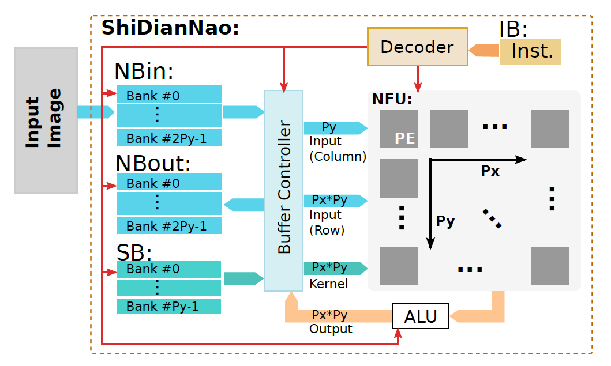

# 系统结构

上图为ShiDianNao的加速器基本架构，使用了systolic阵列式的运算单元和按功能分裂的缓存，主要结构如下所示：

- 分裂缓存：NBin、NBout和SB，分别用于存储输入数、输出数据或部分结果、输入权值
- 缓存控制器（Buffer Controller）：控制缓存与运算单元的交互，提供多种读写缓存的模式
- 控制器（Decoder）：使用两层状态机实现，上层状态机接收指令，控制高级操作类型，下层状态机根据上层状态机的状态控制底层硬件的时序，功能行为类似于对指令进行“时序解码”
- 运算单元：包括NFU和ALU，NFU由PE组成，负责阵列运算，ALU负责阵列运算后的处理

## 缓存控制器（buffer controller）

缓存控制器提供6种缓存读取方式