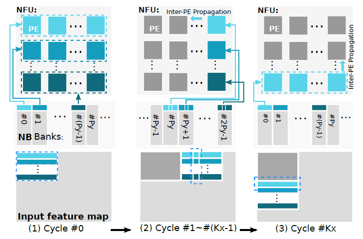

# 系统结构

上图为ShiDianNao的加速器基本架构，使用了systolic阵列式的运算单元和带缓存控制器的按功能分裂的缓存，主要结构如下所示：

- 分裂缓存：NBin、NBout和SB，分别用于存储输入数、输出数据或部分结果、输入权值
- 缓存控制器（Buffer Controller）：控制缓存与运算单元的交互，提供多种读写缓存的模式
- 控制器（Decoder）：使用两层状态机实现，上层状态机接收指令，控制高级操作类型，下层状态机根据上层状态机的状态控制底层硬件的时序，功能行为类似于对指令进行“时序解码”
- 运算单元：包括NFU和ALU，NFU由PE组成，负责阵列运算，ALU负责阵列运算后的处理

# 计算映射

该系统映射卷积操作的主体步骤如下所示：

一个计算的开始首先使用缓存管理器的读取模式a读取Py个Bank同一地址的数据，将$Px \times Py$个数据分别送入对应的运算单元。随后数据窗口向右移动，使用读取模式f读取Py个Bank数据的指定位置数据共Py个送入最右侧的PE，同时所有数据向左平移。当数据窗口需要向下移动时，读取一个bank某个地址所有的数据共Px送入最下方的PE，同时所有数据向上平移，需要注意的是这里平移的数据时FIFO中存储的数据而不是上次计算的数据。数据窗口指定位置划过的数据就是一个卷积窗口的所有数据。