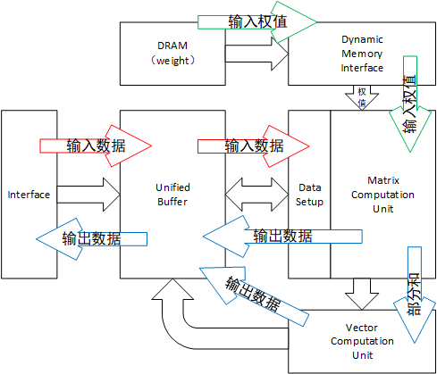

# 系统结构

TPU使用的是比较接近通用处理器的系统结构，没有像DianNao系列一样分裂缓存，而是采取了和CPU类似的方案，使用一个较大的片上缓存保存中间数据和输入数据。对于权值，这一体系将其视为算法参数而不是算法输入，因此采用预载入的方式，没有显式在体系结构中突出缓存buffer的存在（推测应该存在）。这一体系包括以下组件：

- interface：与主机的通信接口，用于传输输入数据和控制数据，采用PCIe接口
- DRAM与Dynamic Memory Interface：使用独占DRAM存储器存储权值数据
- Unified Buffer：片上缓存，用于缓存输入数据、输出数据和中间结果，共24MB，一般足够缓存一层运算所有中间结果，因此一般在运算过程中不需要通过Interface访问数据存储
- Matrix Computation Unit和Data Setup：矩阵计算单元，计算部分可以实现矩阵乘法，Data Setup为近场缓存，用于数据整理，将缓存数据格式转换为矩阵运算单元适用的格式
- Vector Computation Unit：用于处理向量相关运算，可以进行的运算有批标准化，激活函数和池化（包括平均值池化和最大池化）

# 计算映射

相对于其他神经网络加速器，TPU的结构更接近通用处理器架构，可以将其视为以矩阵处理为基本运算的CPU，其中缓存Unified Buffer较大，这样可以使Unified Buffer可以容纳神经网络中每一层的输入与输出数据，即在整个神经网络运算中数据流都被局限在芯片内，不需要通过interface访存缓存取出数据。每次运算可以拆解为以下几个步骤：

1. interface从主机下载输入数据，将其缓存在Unified Buffer中，同时Dynamic Memory Interface从DRAM中载入权值数据
2. 数据从Unified Buffer传输到Data Setup中进行整形，整形后送入矩阵计算单元，同时权值同步流动产生的部分和传输到向量计算单元或直接传输到Unified Buffer（部分和流向与具体执行的操作有关）。此时如果需要，两个数据接口预载入下一次运算需要的数据
3. 当所有运算完成后，结果被缓存到Unified Buffer中，Interface将其上传到主机

这种体系结构比较简单，适应性广，但是存在效率不高，数据流复杂（多个数据流纠缠在Unified Buffer中），对使用者或编程者提出比较大的考验。同时，这种简单的结构易于提升算力（增大缓存），其核心难点在软件上，即如何高效利用矩阵乘法单元。