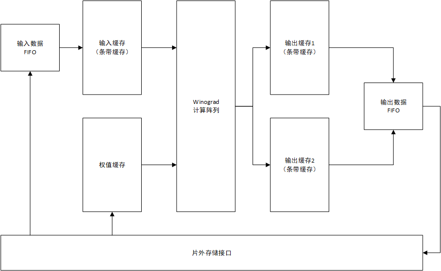

# 总体结构

商汤科技提出的基于FPGA的Winograd卷积加速器总体结构如上图所示，主要分为以下几个步骤：

- 输入缓存和输入数据FIFO：输入数据为条带缓存，FIFO用于连接访存端口和内部缓存
- 权值缓存：用于缓存卷积权值，为一般缓存
- 输出缓存和输出数据FIFO：乒乓Buffer，用于缓存输出数据，FIFO用于连接访存端口和内部缓存
- 计算阵列：使用Winograd加速算法计算卷积的运算阵列
- 片外存储接口：用于连接片内缓存与片外缓存，无法判断数量（可能输入数据和输出数据各独占一个接口）

该加速器的片外存储接口不断以“条带”为单位读入输入数据，通过FIFO将其缓存到输入缓存中，当有n个条带时（输入窗口尺寸为$n \times n$）开始计算基于这n个条带的所有卷积，同时继续缓存条带，直到输入缓存满。当所有依赖于某一个条带的输出数据计算完成后，该条带被丢弃。计算产生的数据被送入输出缓存。输出缓存为乒乓设计，当对一个输出缓存进行写输出时，另一个输出缓存通过FIFO将输出数据写回外部存储。